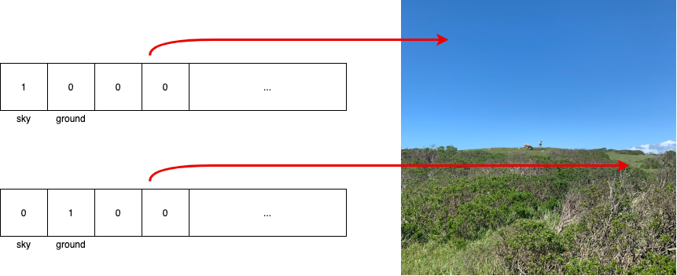

# 💡 Semantic Querying with Lightship ARDK
Semantic segmentation is the process of assigning class labels to specific regions in an image. This richer understanding of the environment can unlock many creative AR features. For example: an AR pet could identify ground to run along, AR planets could fill the sky, the real-world ground could turn into AR lava, and more!

Semantic Querying helps to gather the data that has been predicted by ARDK by clicking on several areas of the world it might be a sky, ground, a person, food, etc.

💡<b>NOTE:</b> Each pixel can have more than one class label, e.g. Artificial ground and Ground.

In ARDK, semantic predictions are served as a buffer of unsigned integers for each pixel of the depth map. Each of a pixel’s 32 bits correspond to a semantic class and is either enabled (value is 1) or disabled (value is 0) depending on whether a part of an object in that class is determined to exist at that pixel.

</img>

## ⚒️ Development Tools
* Unity Engine 2021.3.15f1
* Lightship ARDK 2.3.1
* Visual Studio 2019

## ⚒️ Running Locally
Make sure to use Unity 2020 or higher versions for this project to work properly.
* Download [Unity Hub](https://unity3d.com/get-unity/download "Unity Hub")
* Install Unity version 2020 or higher 
</img>
* Install Android Build Support, OpenJDK, Android SDK & NDK Tools
</img>
* Clone the repository `https://github.com/Priyanshu-CODERX/ardk-occlusion-and-meshing.git`
* Open the project with your Unity Engine
* Switch build platform to Android
* Go to project setting's and change the minimum api level to `Android 7.0 API Level 23`
* Switch to Gradle Version higher than 6.7
* Follow the documentation to update AndroidManifest and Base Gradle Template before building the apk
* Build the apk

## ⚒️ Documentations
* [Semantic Segmentation](https://lightship.dev/docs/ardk/context_awareness/semantic_segmentation/semantics.html "Semantic Segmentation")
* [Building For Android](https://lightship.dev/docs/ardk/ardk_fundamentals/building_android.html#doxid-building-android)